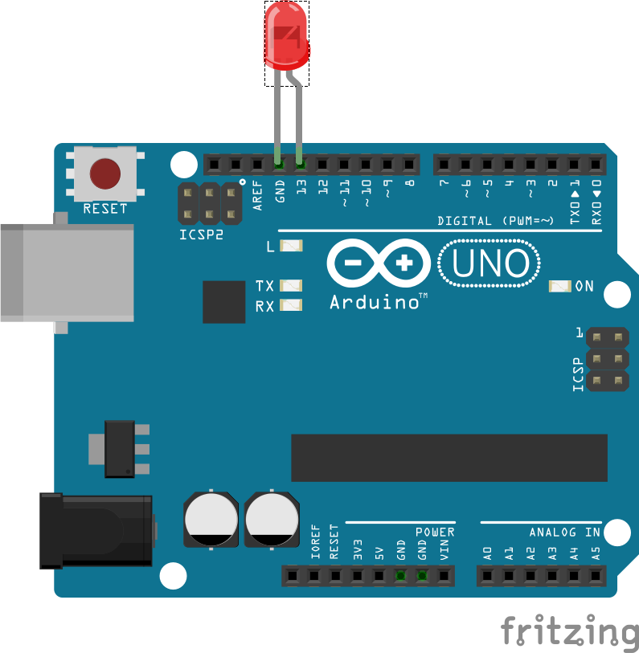

# Arduino Blink PureC



This is an Arduino sketch implemented as pure C.

For this to compile and load to the Arduino Uno you need
the AVR C compiler and Avrdude.

## Installation

Under Linux install the toolchain:

```bash
sudo apt-get update && sudo apt-get install arduino arduino-core
sudo apt-get install gcc-avr binutils-avr gdb-avr avr-libc avrdude make
```

## Compiling

To compile the led program, run make

```bash
make
```

## Deploying to Arduino Uno

In order to upload the binary to your Arduino Uno, check on which port
your Arduino is connected. Replace the port with the default value
in the Makefile (ARDUINO_USB).

Then you can upload the program via:

```bash
make deploy
```

## References

* https://github.com/sagarsp/arduino-blink-c

## License

MIT License